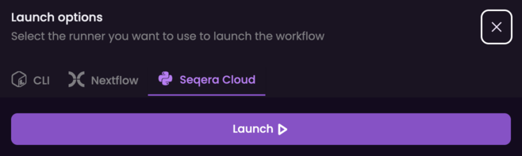

# HT-RNAseq

[](https://www.viash-hub.com/packages/htrnaseq)
[](https://github.com/viash-hub/htrnaseq)
[](https://github.com/viash-hub/htrnaseq/blob/main/LICENSE)
[](https://github.com/viash-hub/htrnaseq/issues)
[](https://viash.io)

## Introduction

This workflow is designed to process high-throughput RNA-seq data, where
every well of a microarray plate is a sample. A fasta file provided as
input defines the mapping between sample barcodes and wells.

The workflow is built in a modular fashion, where most of the base
functionality is provided by components from
[`biobox`](https://www.viash-hub.com/packages/biobox/latest)
supplemented by custom base components and workflow components in this
package.

The full workflow is split in two major subworkflows that can be run
independently:

- **Well-demultiplexing:** Split the input (plate/pool level) fastq
  files per well.
- **Mapping, counting and QC:** Run per-well mapping, counting and
  generate QC reports.

Each of those can be started individually, or the full workflow can be
run in two ways:

1.  Run the [main
    workflow](https://www.viash-hub.com/packages/htrnaseq/v0.3.0/components/workflows/htrnaseq)
    containing the main functionality.
2.  Run the [(opinionated)
    `runner`](https://www.viash-hub.com/packages/htrnaseq/v0.3.0/components/workflows/runner)
    where a number of choices (input/output structure and location) have
    been made.

Input for the workflow has to be `fastq` files (zipped or not). For bcl
or other formats, please consider running
[demultiplex](https://www.viash-hub.com/packages/demultiplex) first.

<div class="mermaid-workflow">


</div>

## Example usage

### Test and example data

If you want to explore this workflow, it’s possible to the use data we
use as test data: [a DRUGseq
dataset](https://www.ncbi.nlm.nih.gov/geo/query/acc.cgi?acc=GSE176150)
from the [NCBI Sequence Read Archive](https://www.ncbi.nlm.nih.gov/sra).
For the unit and integration tests, this data has been (partly)
subsampled to reduce the test runtime. We used
[seqtk](https://github.com/lh3/seqtk) for this with a seed of 1, e.g.:

``` bash
seqtk sample -s1 orig/SRR14730302/VH02001614_S8_R1_001.fastq.gz 10000 > 10k/SRR14730302/VH02001614_S8_R1_001.fastq.gz
```

This data is available at: `gs://viash-hub-test-data/htrnaseq/v1/`.

### Run from Viash Hub

Open [Viash Hub](https://www.viash-hub.com) and browse to the [htrnaseq
component](https://www.viash-hub.com/packages/htrnaseq/v0.3.0/components/workflows/htrnaseq).
Press the ‘Launch’ button and follow the instructions.


We will start an example run loading just one input and using a barcodes
fasta file containing only 2 wells.

In the first step, we add the `local` profile to the list of profiles in
order to limit the cpu and memory requirements of the workflow steps:


In the next step, we provide the paramters as follows:

- `input_r1`:
  `gs://viash-hub-test-data/htrnaseq/v1/100k/SRR14730301/VH02001612_S9_R1_001.fastq`
- `input_r2`:
  `gs://viash-hub-test-data/htrnaseq/v1/100k/SRR14730301/VH02001612_S9_R2_001.fastq`
- `genomeDir`:
  `gs://viash-hub-test-data/htrnaseq/v1/genomeDir/subset/Homo_sapiens/v0.0.3/`
- `barcodesFasta`:
  `gs://viash-hub-test-data/htrnaseq/v1/2-wells-with-ids.fasta`
- `annotation`:
  `gs://viash-hub-test-data/htrnaseq/v1/genomeDir/gencode.v41.annotation.gtf.gz`

Please note that both `input_r1` and `input_r2` can take multiple
values. This means that one has to press ENTER after pasting the input
path.


Press the ‘Launch’ button at the end to get the instructions on how to
run the workflow from the CLI.

### Run using NF-Tower / Seqera Cloud

It’s possible to run the workflow directly from [Seqera
Cloud](https://cloud.seqera.io). The necessary [Nextflow schema
file](https://nextflow-io.github.io/nf-schema/latest/nextflow_schema/nextflow_schema_specification/)
has been built and provided with the workflows in order to use the
form-based input. However, Seqera Cloud can not deal with multiple-value
parameters when using the form-based input. Therefore using Viash Hub is also recommended in this case.

First, select the option to run the workflow using Seqera Cloud. You
will need to create an API token for your account. Once this token is
filled in in the corresponding field, you will get the option to select
a ‘Workspace’ and a ‘Compute environment’.


Next, we need to fill in the parameters for the run. This is similar to
before:


In the next screen, pressing the ‘Launch’ button will actually start the
workflow on Seqera Cloud. A message is shown when the submit was
successful.



### Run from the CLI

Running from the CLI directly without using Viash hub is possible. The
easiest is to just use the integrated help functionality, for instance
using the following:

``` bash
 nextflow run https://packages.viash-hub.com/vsh/htrnaseq.git \
  -revision v0.3.0 \
  -main-script target/nextflow/workflows/runner/main.nf \
  --help
```

### (Optional) Resource usage tuning

Nextflow’s labels can be used to specify the amount of resources a
process can use. This workflow uses the following labels for CPU and
memory: \* `verylowmem`, `lowmem`, `midmem`, `highmem` \* `verylowcpu`,
`lowcpu`, `midcpu`, `highcpu`

The defaults for these labels can be found at
`src/config/labels.config`. Nextflow checks that the specified resources
for a process do not exceed what is available on the machine and will
not start if it does. Create your own config file to tune the labels to
your needs, for example:

    // Resource labels
    withLabel: verylowcpu { cpus = 2 }
    withLabel: lowcpu { cpus = 8 }
    withLabel: midcpu { cpus = 16 }
    withLabel: highcpu { cpus = 32 }

    withLabel: verylowmem { memory = { get_memory( 4.GB * task.attempt ) } }
    withLabel: lowmem { memory = { get_memory( 8.GB * task.attempt ) } }
    withLabel: midmem { memory = { get_memory( 16.GB * task.attempt ) } }
    withLabel: highmem { memory = { get_memory( 64.GB * task.attempt ) } }

When starting nextflow using the CLI, you can use `-c` to provide the
file to nextflow and overwrite the defaults.

## Contributions

Developed in collaboration with Data Intuitive and Open Analytics.

Other contributions are welcome.
