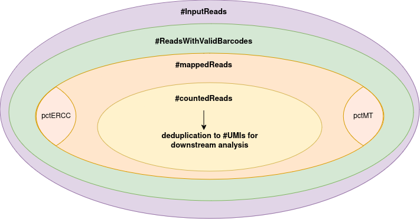

<!---
Copy this template in your working directory (where you want to run the report).
This template can be used as a starting document to run a preliminary DRUGseq report
-->

<!---
Use full page width
-->

<style type="text/css">
div.main-container {
  max-width: 1600px !important;
  margin-left: auto;
  margin-right: auto;
}
</style>


```{r get_params, eval = TRUE, include = FALSE}
outputDir <- params$outputDir
esets <- params$esets
preproc_params_file <- params$preproc_params

```


```{r outputDir, echo = FALSE}
## Required: ABSOLUTE outputDir
outputDir <- file.path(outputDir)

# When working on a windows computer it should be
# "/Users/..." instead of "C:/Users/..."
if (.Platform$OS.type == "windows") {
  outputDir <- paste0(
    "/",
    paste(
      unlist(strsplit(outputDir, split = "/"))[-1], collapse = "/"
    ),
    "/"
  )
}
```


```{r optionsChunkDoNotModify, echo = FALSE, message = FALSE, warning=FALSE}

## Chunk with options for knitr. This chunk should not be modified.
knitr::opts_chunk$set(
  eval = TRUE,
  echo = FALSE, 
  message = FALSE,
  cache = FALSE,
  warning = FALSE,
  error = FALSE,
  comment = NA, #"#",
  tidy = FALSE,
  collapse = TRUE,
  out.width = "100%",
  fig.width = 20,
  fig.height = 10,
  results = "asis")

knitr::opts_knit$set(root.dir = getwd())

options(warn = 1, width = 200)

```

```{r libraries_and_functions}
source("plateLayouts.R")
library(ComplexHeatmap)
library(data.table)
library(ggplot2)
library(knitr)
library(Biobase)
library(gridExtra)
library(RColorBrewer)
library(yaml)
```


```{r dataImport}

# Create esetList
esetList <- sapply(
  esets, simplify = FALSE,
  USE.NAMES = TRUE,
  function(eset_raw) {
    if (!file.exists(eset_raw)) {
      stop(paste0("Provided path '", eset_raw, "' is not a file."))
    }
    eset <- readRDS(eset_raw)
  }
)
pools <- sapply(esetList, function(eset) {
  unique(eset$PoolName)
})
names(esetList) <- unlist(pools)

# Create qcData
pDataList <- lapply(esetList, function(eset) data.table(pData(eset)))
qcData <- rbindlist(pDataList, fill = TRUE)
qcData[, nMappedReads_per_UMI :=  NumberOfMappedReads/NumberOfUMIs]

textVars <- "SampleName"
annotationVar <- "PoolName"

if (!"SampleName" %in% names(qcData)) {
  qcData[, SampleName := paste0(PoolName, "_", WellBC)]
}
qcData[, log10LibSize := round(log10(NumberOfInputReads))]
qcData[, (annotationVar) := lapply(.SD, as.factor), .SDcols = annotationVar]


colourList <- list()
Design_levels <- sort(
  as.character(unique(qcData[, ..annotationVar][[1]])),
  decreasing = TRUE
)

if (length(Design_levels) == 1) {
  colours <- c("#d6e0ff", "lightgrey")
  names(colours) <- c(Design_levels, "Empty")
    colourList[[annotationVar]] <- list(
      "colours" = colours,
      "annotVar" = annotationVar,
      "text" = textVars
    )
}else if (length(Design_levels) == 2) {
  colours <- c("#d6e0ff", "#FF9999")

  names(colours) <- c(Design_levels)
  colourList[[annotationVar]] <- list(
    "colours" = colours,
    "annotVar" = annotationVar,
    "text" = textVars
  )
} else if (length(Design_levels) <= 20) {

  if (length(Design_levels) > 12) {
    colours <- c(
      brewer.pal(12, "Set3"),
      brewer.pal((length(Design_levels) - 12),
      "Pastel2")
    )
  } else {
    colours <- c(brewer.pal(length(Design_levels), "Set3"))
  }

  names(colours) <- c(Design_levels)
  colourList[[annotationVar]] <- list(
    "colours" = colours,
    "annotVar" = annotationVar,
    "text" = textVars
  )
} else {
  colours <- c("#d6e0ff")
  names(colours) <- c("nonEmpty")
  colourList[[annotationVar]] <- list(
    "colours" = colours,
    "annotVar" = annotationVar,
    "text" = annotationVar
  )
}
```


```{r versions_and_params, results="asis", eval = !is.null(preproc_params_file)}

preproc_params <- gsub(" ", "", unlist(read_yaml(preproc_params_file)))

cat("# Parameters", "\n\n",
    "<blockquote>", "\n\n",
    "**The preprocessing parameters were: ** <br>",
    "`project id: ", preproc_params["project_id"],"`  \n",
    "`experiment id: ", preproc_params["experiment_id"],"`  \n",
    "`run id: ", preproc_params["run_id"],"` \n",
    "`raw data location: ", preproc_params["input"], "`  \n",
    "`well barcodes: ", preproc_params["barcodesFasta"],"`  \n",
    "`genome reference: ", preproc_params["genomeDir"],"`  \n",
    "`gtf annotation: ", preproc_params["annotation"],"`  \n",
    "`UMI length: ", preproc_params["umi_length"], "`",
    "</blockquote>",sep="")


```


# Pool Description

Per pool within this study, there are several pool layout plots shown, based on the

* number of STAR input reads (= library size)

* log10 transformed number of STAR input reads

* number of detected UMIs

* number of detected genes

* number of chromosomal reads 

* percentage of ERCC 

* percentage of mitochondria 


> The values for the different samples within each pool is expected to be comparable if the content of the different pools is equally diverse.

```{r plateAnnotation, out.width = "100%",fig.width = 20, fig.height= 10}

plateVars <- c("NumberOfInputReads", "log10LibSize", "NumberOfMappedReads",
               "NumberOfChromReads", "NumberOfUMIs", "NumberOfGenes",
               "pctMT", "pctERCC")

breaksVars <- lapply(
  plateVars,
  function(var) {
    computeBreaks(7, qcData[, ..var])
  }
)
names(breaksVars) <- plateVars

for (pool in pools){
  cat("\n\n")
  cat(paste0("## ", pool, " {.tabset} \n\n"))
  poolData <- qcData[PoolName == pool]
  lapply(plateVars, function(plateVar) {
    cat("\n\n")
    cat(sprintf("### %s {.unnumbered}", plateVar))
    cat("\n\n")
    plateLayout(
      poolData, valueVariable = plateVar,
      textFontSize = 10, legendFontSize = 12,
      plateName = pool, plot.title = "libSize - ",
      legend.title = "libSize", breaks = breaksVars[[plateVar]]
    )
    cat("\n\n")
  })
  cat("\n\n")
}
```

<br>


# Data Distributions


## Reads Distributions {.tabset}

The 4 box plots below represent the distributions per pool of the different samples based on:

* the number of STAR input reads

* the number of STAR mapped reads

* the percentage of STAR mapped reads

* the number of detected genes

> The distributions contribute to the QC metrics mentioned in Par 3. The higher these values, the better.
> The data range for the different plates is expected to be comparable if the content of the different plates is equally diverse.


### Number of Input Reads {.tabset .unnumbered}

```{r settings_1}

nColPlots = 1
figHeight = 7

```

#### Distribution {.tabset .unnumbered}


```{r boxplots_input_plate, fig.height = figHeight}
ggplot(
  qcData,
  aes(
    x = PoolName,
    y = NumberOfInputReads, colour = PoolName
  )
) + geom_boxplot() + ylab("Number of Input Reads") +
  ggtitle("Number of Input Reads") +
  theme(
    strip.text.x = element_text(size = 20),
    panel.spacing = unit(2, "lines"),
    text = element_text(size = 10),
    axis.text.y = element_text(angle = 90, size = 14),
    plot.title = element_text(size = 18),
    legend.text = element_text(size = 15),
    legend.title = element_text(size = 17),
    axis.title = element_text(size = 15),
    axis.text.x = element_blank(),
    axis.ticks.x = element_blank()
  )

```


### Number of Mapped Reads {.tabset .unnumbered}

#### Distribution {.unnumbered}

```{r boxplots_mapped_plate, fig.height = figHeight}

ggplot(
  qcData,
  aes(x = PoolName, y = NumberOfMappedReads, colour = PoolName)
) + geom_boxplot() + ylab("Number of Mapped Reads") +
  ggtitle("Number of Mapped Reads") +
  theme(
    strip.text.x = element_text(size = 20),
    panel.spacing = unit(2, "lines"),
    text = element_text(size = 10),
    axis.text.y = element_text(angle = 90, size = 14),
    plot.title = element_text(size = 18),
    legend.text = element_text(size = 15),
    legend.title = element_text(size = 17),
    axis.title.y = element_text(size = 15),
    axis.text.x = element_blank(),
    axis.ticks.x = element_blank()
  )
```


#### pct Mapped Reads {.unnumbered}

```{r boxplots_pctMapped_plate, fig.height = figHeight}
ggplot(
  qcData,
  aes(x = PoolName, y = PctMappedReads, colour = PoolName)
) +
  geom_boxplot() +
  ylab("pct Mapped Reads") +
  ggtitle("pct Mapped Reads") +
  theme(
    strip.text.x = element_text(size = 20),
    panel.spacing = unit(2, "lines"),
    text = element_text(size = 10),
    axis.text.y = element_text(angle = 90, size = 14),
    plot.title = element_text(size = 18),
    legend.text = element_text(size = 15),
    legend.title = element_text(size = 17),
    axis.title.y = element_text(size = 15),
    axis.text.x = element_blank(),
    axis.ticks.x = element_blank()
  )
```

### Number of Chromosomal Reads {.tabset .unnumbered}

#### Distribution {.unnumbered}

```{r boxplots_chrom_plate, fig.height = figHeight}

ggplot(
  qcData,
  aes(x = PoolName, y = NumberOfChromReads, colour = PoolName)
) + geom_boxplot() + ylab("Number of Chromosomal Reads") +
  ggtitle("Number of Chromosomal Reads") +
  theme(
    strip.text.x = element_text(size = 20),
    panel.spacing = unit(2, "lines"),
    text = element_text(size = 10),
    axis.text.y = element_text(angle = 90, size = 14),
    plot.title = element_text(size = 18),
    legend.text = element_text(size = 15),
    legend.title = element_text(size = 17),
    axis.title.y = element_text(size = 15),
    axis.text.x = element_blank(),
    axis.ticks.x = element_blank()
  )

```

#### pct Chromosomal Reads {.unnumbered}

```{r boxplots_pctChrom_plate, fig.height = figHeight}

ggplot(
  qcData,
  aes(x = PoolName, y = pctChrom, colour = PoolName)
) + geom_boxplot() + ylab("pct Chromosomal Reads") +
  ggtitle("pct Chromosomal Reads") +
  theme(
    strip.text.x = element_text(size = 20),
    panel.spacing = unit(2, "lines"),
    text = element_text(size = 10),
    axis.text.y = element_text(angle = 90, size = 14),
    plot.title = element_text(size = 18),
    legend.text = element_text(size = 15),
    legend.title = element_text(size = 17),
    axis.title.y = element_text(size = 15),
    axis.text.x = element_blank(),
    axis.ticks.x = element_blank()
  )
```

### Number of UMIs {.tabset .unnumbered}

#### Distribution {.tabset .unnumbered}


```{r boxplots_umi_plate, fig.height = figHeight}

ggplot(
  qcData,
  aes(x = PoolName, y = NumberOfUMIs, colour = PoolName)
) + geom_boxplot() + ylab("Number of UMIs") +
  ggtitle('Number of UMIs') +
  theme(
    strip.text.x = element_text(size = 20),
    panel.spacing = unit(2, "lines"),
    text = element_text(size = 10),
    axis.text.y = element_text(angle = 90, size = 14),
    plot.title = element_text(size = 18),
    legend.text = element_text(size = 15),
    legend.title = element_text(size = 17),
    axis.title = element_text(size = 15),
    axis.text.x = element_blank(),
    axis.ticks.x = element_blank()
  )

```

#### Density distribution {.unnumbered}

```{r density_numberOfUMIs, fig.width=min(c(14, length(unique(qcData$PoolName))*7)), fig.width=min(c(32, length(unique(qcData$PoolName))*7)),}

## Pre-filtering data exploration
dt_plot <- melt(
  qcData,
  id.vars = c("SampleName", "PoolName", "WellID"),
  measure.vars = c("NumberOfInputReads", "NumberOfMappedReads", "NumberOfUMIs")
)

readsDensity_plot <- ggplot(dt_plot, aes(value))
readsDensity_plot <- readsDensity_plot +
  geom_density(aes(fill = variable), alpha=0.8) +
  facet_wrap(~ PoolName, scales = "free_x", space = "fixed", drop = TRUE, ncol = 4) +
  geom_vline(
    xintercept = 5e5,
    linetype = "dashed",
    color = "steelblue3", size = 2
  ) +
  annotate(
    "text",
    x = 3.5e5, y = 2e-6, label = "500k",
    angle = 90, color = "steelblue3", size = 10
  ) +
  geom_vline(
    xintercept = 1.5e6, linetype = "dashed",
    color = "forestgreen", size = 2
  ) +
  annotate(
    "text", x = 1.35e6, y = 2e-6, label = "1.5M",
    angle = 90, color = "forestgreen", size = 10
  ) +
  labs(
    title = "Density plot",
    subtitle = paste0(
      "# Samples with NumberOfMappedReads > 1.5M: ",
      length(which(qcData$NumberOfMappedReads > 1.5e6)),
      "\n# Samples with NumberOfUMIs > 500k: ",
      length(which(qcData$NumberOfUMIs > 5e5))
    ),
    caption = paste0("# Total samples (after removing empty): ", nrow(qcData)),
    x = "Count",
    fill = "Variable"
  ) +
  theme(
    strip.text.x = element_text(size = 20),
    panel.spacing = unit(2, "lines"),
    text = element_text(size = 5),
    axis.text.x = element_text(angle = 90, size = 14),
    plot.title = element_text(size = 18),
    plot.subtitle = element_text(size = 17),
    plot.caption = element_text(size = 15),
    legend.text = element_text(size = 15),
    legend.title = element_text(size = 17),
    axis.title = element_text(size = 15),
    axis.text.y = element_blank(),
    axis.ticks.y = element_blank(),
    axis.title.y = element_blank()
  )
readsDensity_plot

```


### Number of Genes {.tabset .unnumbered}

#### Distribution {.unnumbered}

```{r boxplots_genes_plate, fig.height = figHeight}
ggplot(
  qcData,
  aes(x = PoolName, y = NumberOfGenes, colour = PoolName)
) +
  geom_boxplot() + ylab("Number of Genes") + 
  ggtitle("Number of Genes") + 
  theme(
    strip.text.x = element_text(size = 20),
    panel.spacing = unit(2, "lines"),
    text = element_text(size = 10),
    axis.text.y = element_text(angle = 90, size = 14),
    plot.title = element_text(size = 18),
    legend.text = element_text(size = 15),
    legend.title = element_text(size = 17),
    axis.title.y = element_text(size = 15),
    axis.text.x = element_blank(),
    axis.ticks.x = element_blank()
  )
```

## {.tabset .toc-ignore .unnumbered}


In addition, several plots are shown visualizing the efficiency of the reads-to-genes translation:

* the number of input reads vs the number of mapped reads

* the number of chromosomal reads vs the number of mapped reads

* the number of mapped reads per UMI vs the number of mapped reads 

* the number of UNI vs the number of mapped reads

* the number of mapped reads vs the number of genes

* the number of chromosomal reads vs the number of genes

* the number of mapped reads per UMI vs the number of genes 

### Mapping Efficiency {.tabset .unnumbered}

#### Number of Input Reads {.unnumbered}

```{r mapping_efficiency_1_plate, fig.height = 7}

ggplot(
  qcData,
  aes(x = NumberOfInputReads, y = NumberOfMappedReads, colour = PoolName)
) + 
  geom_point() +
  xlab("Number of Input Reads") +
  ylab("Number of Mapped Reads") +
  ggtitle("Number of Mapped Reads vs Number of Input Reads") + 
  theme(
    strip.text.x = element_text(size = 20),
    panel.spacing = unit(2, "lines"),
    text = element_text(size = 10),
    axis.text = element_text(angle = 90, size = 15),
    plot.title = element_text(size = 18),
    legend.text = element_text(size = 15),
    legend.title = element_text(size = 17),
    axis.title = element_text(size = 15)
  )

```


#### Number of Chromosomal Reads {.unnumbered}

```{r mapping_efficiency_2_plate, fig.height = 7}

ggplot(
  qcData,
  aes(x = NumberOfChromReads, y = NumberOfMappedReads, colour = PoolName)
) + geom_point() +
  xlab("Number of Chromosomal Reads") + ylab("Number of Mapped Reads") +
  ggtitle("Number of Chromosomal Reads vs Number of Mapped Reads") +
  theme(
    strip.text.x = element_text(size = 20),
    panel.spacing = unit(2, "lines"),
    text = element_text(size = 10),
    axis.text = element_text(angle = 90, size = 15),
    plot.title = element_text(size = 18),
    legend.text = element_text(size = 15),
    legend.title = element_text(size = 17),
    axis.title = element_text(size = 15)
)

```


#### Number of UMI {.unnumbered}

```{r mapping_efficiency_4_plate, fig.height = 7}

ggplot(
  qcData,
  aes(x =NumberOfUMIs, y =  NumberOfMappedReads, colour = PoolName)
) + geom_point() +
  ylab("Number of Mapped Reads") + xlab("Number of UMIs ") +
  ggtitle("Number of UMIs vs Number of Mapped Reads") +
  theme(
    strip.text.x = element_text(size = 20),
    panel.spacing = unit(2, "lines"),
    text = element_text(size = 10),
    axis.text = element_text(angle = 90, size = 15),
    plot.title = element_text(size = 18),
    legend.text = element_text(size = 15),
    legend.title = element_text(size = 17),
    axis.title = element_text(size = 15)
  )

```

#### Number of Mapped Reads Per UMI {.unnumbered}

```{r mapping_efficiency_5_plate, fig.height = 7}
 
 ggplot(qcData, aes(x = nMappedReads_per_UMI, y = NumberOfMappedReads, colour = PoolName)) + 
  geom_point() + 
  xlab('Number of Mapped Reads per UMI') + ylab("Number of Mapped Reads") +
  ggtitle('Number of Mapped Reads per UMI vs Number of Mapped Reads') + 
  theme(strip.text.x = element_text(size = 20),
        panel.spacing = unit(2, "lines"), 
        text = element_text(size=10), 
        axis.text = element_text(angle = 90,size = 15), 
        plot.title = element_text(size=18), 
        legend.text = element_text(size=15), 
        legend.title = element_text(size = 17), 
        axis.title = element_text(size = 15))


```

### Counting Efficiency {.tabset .unnumbered}

#### Number of Mapped Reads {.unnumbered}

```{r gene_efficiency_1_plate, fig.height = 7} 
ggplot(
  qcData,
  aes(x = NumberOfMappedReads, y = NumberOfGenes, colour = PoolName)
) + geom_point() +
  ylab("Number of Genes") + xlab("Number of Mapped Reads") +
  ggtitle("Number of Genes vs Number of Mapped Reads") +
  theme(
    strip.text.x = element_text(size = 20),
    panel.spacing = unit(2, "lines"),
    text = element_text(size = 10),
    axis.text = element_text(angle = 90, size = 15),
    plot.title = element_text(size = 18),
    legend.text = element_text(size = 15),
    legend.title = element_text(size = 17),
    axis.title = element_text(size = 15)
  )
```

#### Number of Chromosomal Reads {.unnumbered}

```{r gene_efficiency_2_plate, fig.height = 7} 
ggplot(
  qcData,
  aes(x = NumberOfChromReads, y = NumberOfGenes, colour = PoolName)
) + geom_point() +
  ylab("Number of Genes") + xlab("Number of Chromosomal Reads") +
  ggtitle("Number of Genes vs Number of Chromosomal Reads") +
  theme(
    strip.text.x = element_text(size = 20),
    panel.spacing = unit(2, "lines"),
    text = element_text(size = 10),
    axis.text = element_text(angle = 90, size = 15),
    plot.title = element_text(size = 18),
    legend.text = element_text(size = 15),
    legend.title = element_text(size = 17),
    axis.title = element_text(size = 15)
  )
```


#### Number of Mapped Reads per UMI {.unnumbered}

```{r gene_efficiency_3_plate, fig.height = 7} 

ggplot(qcData, aes(x = nMappedReads_per_UMI, y = NumberOfGenes, colour = PoolName)) + geom_point() + 
     ylab('Number of Genes') + xlab("Number of Mapped Reads per UMI") + ggtitle('Number of Genes vs Number of Mapped Reads per UMI') + 
  theme(strip.text.x = element_text(size = 20),
        panel.spacing = unit(2, "lines"), 
        text = element_text(size=10), 
        axis.text = element_text(angle = 90,size = 15), 
        plot.title = element_text(size=18), 
        legend.text = element_text(size=15), 
        legend.title = element_text(size = 17), 
        axis.title = element_text(size = 15))


```
## Sequencing Saturation {.tabset}

The barplots below represent the sequencing saturation per sample as determined by STAR, split per pool. 
The HT-RNAseq platform aims for shallow sequencing resulting in relatively low sequencing saturations of 10-20%.
In addition, the sequencing saturation vs the number of input reads is shown.

### Sequencing Saturation {.unnumbered}


```{r sequencingSaturation, fig.height = figHeight}

ggplot(
  qcData,
  aes(x = WellID, y = SequencingSaturation, fill = PoolName)
) + geom_bar(stat = "identity", position = "dodge") +
  xlab("Samples") + ggtitle("Sequencing Saturation per Sample") +
  theme(
    strip.text.x = element_text(size = 20),
    panel.spacing = unit(1, "lines"),
    text = element_text(size = 10),
    plot.title = element_text(size = 18),
    legend.text = element_text(size = 15),
    legend.title = element_text(size = 17),
    axis.title = element_text(size = 15),
    axis.text.x = element_blank(),
    axis.text.y = element_text(size = 15),
    axis.ticks.x = element_blank()
  )
```

### Sequencing Saturation - Input Reads {.unnumbered}


```{r sequencingSaturation_inputReads, fig.height = figHeight}


ggplot(
  qcData,
  aes(x = NumberOfInputReads, y = SequencingSaturation, colour = PoolName)
) + geom_point() +
  ggtitle("Sequencing Saturation vs Number of Input Reads") +
  theme(strip.text.x = element_text(size = 20),
    panel.spacing = unit(2, "lines"),
    text = element_text(size = 10),
    axis.text = element_text(angle = 90, size = 15),
    plot.title = element_text(size = 18),
    legend.text = element_text(size = 15),
    legend.title = element_text(size = 17),
    axis.title = element_text(size = 15)
  )
```

### Sequencing Saturation  - Mapped Reads {.unnumbered}

```{r sequencingSaturation_mappedReads, fig.height = figHeight}
ggplot(
  qcData,
  aes(x = NumberOfChromReads, y = SequencingSaturation, colour = PoolName)
) + geom_point() +
  ggtitle("Sequencing Saturation vs Number of Chromosomal Reads") +
  theme(
    strip.text.x = element_text(size = 20),
    panel.spacing = unit(2, "lines"),
    text = element_text(size=10),
    axis.text = element_text(angle = 90, size = 15),
    plot.title = element_text(size=18),
    legend.text = element_text(size = 15),
    legend.title = element_text(size = 17),
    axis.title = element_text(size = 15)
)
```

<br>

## Genomic Origin {.tabset} 

The 3 boxplots below represent, per pool, the distributions of the percentage of reads mapping to:

* chromosomal regions

* mitochondrial regions

* ERCC spike-ins

The 4th plot summarises the above results across samples per pool.

The 5th plot shows the percentage of reads mapped to the transcriptome (as counted by STAR).  This  measurement serves as a proxy for the percentage of reads mapped to exons.

> The percentage ERCC contributes to the QC metrics mentioned in Par 3. This value is ideally as low as possible (but non-zero to ensure the they have been spiked in) and comparable for the different pools.


### pctChrom {.tabset .unnumbered}


```{r genomicOrigin_chrom_plate, fig.height = figHeight}

ggplot(
  qcData, aes(x = PoolName, y = pctChrom, colour = PoolName)
) +
  geom_boxplot() +
  ggtitle("pctChrom") +
  theme(
    strip.text.x = element_text(size = 20),
    panel.spacing = unit(2, "lines"),
    text = element_text(size = 10),
    axis.text.y = element_text(angle = 90, size = 14),
    plot.title = element_text(size = 18),
    legend.text = element_text(size = 15),
    legend.title = element_text(size = 17),
    axis.title.y = element_text(size = 15),
    axis.text.x = element_blank(),
    axis.ticks.x = element_blank()
  )
```


### pctMT {.tabset .unnumbered}

```{r genomicOrigin_mt_plate, fig.height = figHeight}

ggplot(
  qcData,
  aes(x = PoolName, y = pctMT, colour = PoolName)
) +
  geom_boxplot() + ggtitle("pctMT") +
  theme(
    strip.text.x = element_text(size = 20),
    panel.spacing = unit(2, "lines"),
    text = element_text(size = 10),
    axis.text.y = element_text(angle = 90, size = 14),
    plot.title = element_text(size = 18),
    legend.text = element_text(size = 15),
    legend.title = element_text(size = 17),
    axis.title.y = element_text(size = 15),
    axis.text.x = element_blank(),
    axis.ticks.x = element_blank()
  )
```

### pctERCC {.tabset .unnumbered}


```{r genomicOrigin_ercc_plate, fig.height = figHeight}
ggplot(qcData, aes(x = PoolName, y = pctERCC, colour = PoolName))  +
  geom_boxplot() +
  ggtitle("pctERCC") +
  theme(
    strip.text.x = element_text(size = 20),
    panel.spacing = unit(2, "lines"),
    text = element_text(size = 10),
    axis.text.y = element_text(angle = 90, size = 14),
    plot.title = element_text(size = 18),
    legend.text = element_text(size = 15),
    legend.title = element_text(size = 17),
    axis.title.y = element_text(size = 15),
    axis.text.x = element_blank(),
    axis.ticks.x = element_blank()
  )
```


### Genomic Summary {.tabset .unnumbered}


```{r genomicOrigin_summary_plate}
meanPctChromMTData <- qcData[, .(
  "pctChrom" = median(pctChrom),
  "pctMT" = median(pctMT),
  "pctERCC" = median(pctERCC)
), by = PoolName]
meanPctChromMTDataLong <- melt(
  meanPctChromMTData,
  id.vars = "PoolName",
  measure.vars = c("pctChrom", "pctMT", "pctERCC"),
  variable.name = "Origin", value.name = "pct"
)
ggplot(
  meanPctChromMTDataLong,
  aes(fill = Origin, y = pct, x = PoolName)) +
  geom_bar(position = "stack", stat = "identity") +
  ggtitle("Genomic Origin") +
  theme(
    text = element_text(size = 10),
    axis.text = element_text(angle = 90, size = 15),
    plot.title = element_text(size = 18),
    legend.text = element_text(size = 15),
    legend.title = element_text(size = 17),
    axis.title = element_text(size = 15)
  )

```


# Depletion {.tabset}   

<div align="center">
```{r depletion}


for (eset_name in pools) {
  cat("\n\n")
  cat(paste0("## ", eset_name, " {.unnumbered}"))
  cat("\n\n")

  eset <- esetList[[eset_name]]
  average_reads <- sort(apply(exprs(eset), 1, mean), decreasing = TRUE)
  plotData <- data.table(
    ENSGID = names(average_reads),
    av_count = average_reads
  )

  gen_descript <- data.table(
    ENSGID = eset@featureData@data$gene_id,
    Description = eset@featureData@data$GENENAME
  )
  order_gen_descript <- gen_descript[
    match(plotData$ENSGID, gen_descript$ENSGID),
  ]

  g <- ggplot(
    plotData[c(1:100)],
    aes(x = reorder(ENSGID, -av_count), y = av_count)
  ) + geom_bar(stat = "identity") +
    theme(
      axis.text.x = element_text(angle = 90, vjust = 0.5, hjust = 1, size = 12),
      axis.text.y = element_text(size = 12),
      legend.text = element_text(size = 15),
      legend.title = element_text(size = 15),
      axis.title = element_text(size = 18),
      plot.title = element_text(size = 20)
    ) + ylab("Average Counts") + xlab("Genes")

  print(g)

  cat("\n\n")
  cat("<br>")
  cat("<br>")

  print(htmltools::tagList((DT::datatable(order_gen_descript[1:100, ]))))
}
```
</div>


<br>
<br>
<br>
<br>

# Glossary {.unnumbered}


## Read {.unlisted .unnumbered}

A read is a oligonucleotide (a short RNA fragment) that has been sequenced. It consists of a fixed number of base pairs (bp) and therefore has a specific read length.


## Input Read {.unlisted .unnumbered}

Each read of the fastq file used as input to the STAR aligner is considered an input read.


## Read With Valid Barcode {.unlisted .unnumbered}

A read with a valid barcode is a read for which the barcode matches the white list of barcodes under the given restriction of the number of allowed mismatches. The number of reads with a valid barcode is lower or equal to the number of input reads.


## Mapped Read {.unlisted .unnumbered}

A read that has been aligned against the reference genome and for which one or more suitable matching locations have been found is a mapped read. Depending on the number of allowed mismatches this might or might not be be an exact match. The number of mapped reads is lower or equal to the number of reads with a valid barcode.


## Uniquely Mapped Read {.unlisted .unnumbered}

A read for which one and only one suitable matching location in the reference genome was found is an uniquely mapped read. The number of uniquely mapped reads is lower or equal to the number of mapped reads.


## Counted Read {.unlisted .unnumbered}

A mapped read will only be counted if it overlaps (1 nucleotide or more) with one and only one gene. The number of counted reads is lower or equal to the number of (uniquely) mapped reads.


## UMIs {.unlisted .unnumbered}

Unique molecular identifiers (UMI) are short sequences in order to uniquely tag each molecule in a sample library. Sequencing with UMIs allows bioinformatics software to filter out duplicate reads and PCR errors with a high level of accuracy and report unique reads.

The reported UMIs is the number of UMIs among the set of reads that map to an unique gene, i.e the number of reads is deduplicated.


## pctERCC {.unlisted .unnumbered}

The percentage of reads mapping to the ERCC genes among the total number of **mapped** reads.


## pctMT {.unlisted .unnumbered}

The percentage of reads mapping to the MT genes among the total number of **mapped** reads.


## Sequencing Saturation {.unlisted .unnumbered}

The sequencing saturation is a measure of the fraction of library complexity. The inverse of one minus the sequencing saturation can be interpreted as the number of additional reads it would take to detect a new transcript. Consequently, a low sequencing saturation indicates a shallow sequencing in which a new transcript could be discovered with a few reads.

<br>
<br>
<br>
<br>

<center>

</center>

<br>
<br>
